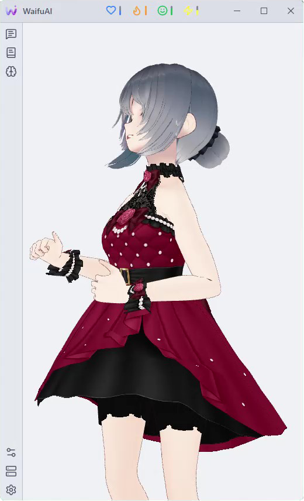
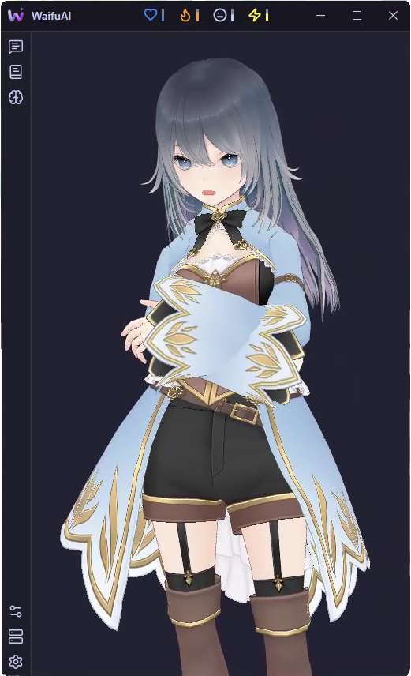
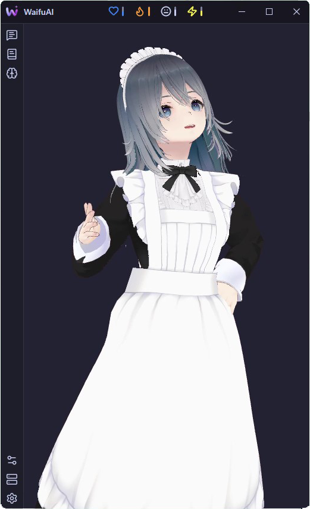
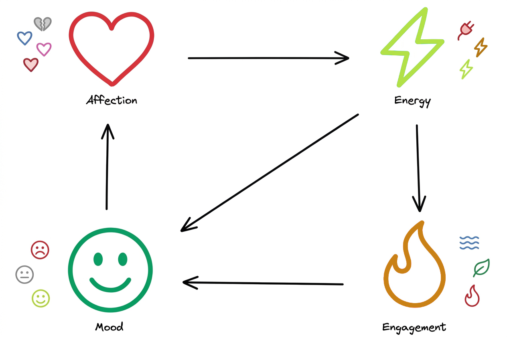

# 💙 WaifuAI

  <picture>
    <source media="(prefers-color-scheme: dark)" srcset="docs/images/waifu-ai-logo-dark.png">
    <source media="(prefers-color-scheme: light)" srcset="docs/images/waifu-ai-logo-light.png">
    
  </picture>

**WaifuAI** is your personal 3D desktop companion app. The project is designed to simulate communicating with a real girl via AI as detailed as possible, even with weak local LLMs.

## ✨ Main Features

### 👤 Character Model

  &emsp;
  &emsp;
  &emsp;
  &emsp;

WaifuAI features the integration of 3D models in the `.vrm` format. For a quick start, 4 base models created by [白い白米](https://hub.vroid.com/en/users/24352731) are already built into the app. A huge selection of free (and paid) models is available on [VRoid Hub](https://hub.vroid.com/en/search/%23BOOTH) or [BOOTH](https://booth.pm/en).

The model can react to the dialogue context with various **movements** and **emotions**. The model also features **lip-sync**.

You can also set one of 3 camera distances to the character.

### 👄 Voice

Currently, voice acting is only supported using local [SileroTTS](https://github.com/snakers4/silero-models) models. Voice acting is available in 5 languages:

* 🇬🇧 English
* 🇩🇪 German
* 🇷🇺 Russian
* 🇪🇸 Spanish
* 🇫🇷 French

### 🌀 Mood System

WaifuAI implements a **Mood System**, which is a powerful mathematical framework based on a probabilistic structure and **4 parameters**:

* ❤️ Affection
* 🔥 Engagement
* 😃 Mood
* ⚡ Energy

    

These parameters change depending on your interaction with her and other external factors. They influence each other in different ways, and various **combinations** of these parameters shape her specific attitude towards you and can also trigger various **events**.

For example, a very tired assistant might go to sleep and text you first in the morning. And with high **Affection**, *something special* might happen.

### 🎭 Personality Archetypes

There are **13** anime personality archetypes available to choose from, which shape the nature of the assistant's communication with you:

* 🔥 tsundere
* 🧊 kuudere
* 😳 dandere
* 💓 deredere
* 🌞 genki
* 🔪 yandere
* ❤️‍🔥 teasedere
* ⚫ dorodere
* 💧 utsudere
* 🐔 bakadere
* 💤 darudere
* 🚬 hinedere
* 🩸 sadodere

Each archetype has its own parameters and quirks within the **Mood System**.
The prompt for any archetype can be completely customized. You can also switch between them at any time, creating unpredictable reactions and situations.

### 🧠 Memory

WaifuAI implements a **Knowledge Base** — she remembers facts about herself that she mentioned earlier, ensuring she always remembers them regardless of the context length. This works exceptionally well in combination with weak local LLMs.

### 🕒 Time

The assistant is sensitive to **time**. She sees when each message was sent and can understand how long you haven't talked to her, how long you've known each other, what time of day it is, and what day it is today. Depending on her **archetype**, she reacts differently to time intervals.

## 🚀 Quickstart

### 📥 Installation

1. Download the archive for your operating system from the [Releases](https://github.com/altesco/WaifuAI/releases) section.
2. Extract the archive to a convenient location.
3. On **Windows**, run `WaifuAI.exe`; on **Linux**, run `WaifuAI`.

### ⚙️ Post-installation

1. Initially, 4 character models are available, which can be changed in `Settings` &#8594; `Appearance` &#8594; `Character Model`. You can also download models, for example, from [here](https://hub.vroid.com/en/search/%23BOOTH).
2. Select and download a voice model in `Settings` &#8594; `Audio` &#8594; `Engine`. You can change the voice model language in `Settings` &#8594; `General` &#8594; `AI Language`.
3. In the sidepanel under `Model Source`, select the AI provider:

    * To run a **local** model, enter the `Port` and `IP Address` (for example, for **LM Studio**, the defaults are `1234` and `127.0.0.1` respectively).
    * To run cloud models, you need to insert your `API Key`, the provider's endpoint into `API URL`, and the model name into `Model`. WaifuAI uses an OpenAI-compatible API.

## 🛠 Technical Details

### 📦 No Dependencies

WaifuAI **does not require** any separate dependencies to run, only an externally running LLM. Everything else works out of the box — in particular, Python dependencies are already bundled in the archives in [Releases](https://github.com/altesco/WaifuAI/releases).

### 🎨 Interface

WaifuAI is developed using the AvaloniaUI framework in C# and is cross-platform, supporting Windows 10/11 and Linux-based distributions.

**3D Rendering** implemented via Three.js inside a WebView. VRM model integration is handled using [three-vrm](https://github.com/pixiv/three-vrm).

All settings and dialogue history are stored strictly locally in an SQLite database, so when using local LLMs, your conversations with the AI remain **completely private**.

## ⚠️ Known Issues

* The mood system might be unstable and contain logical errors.
* 3D models can sometimes have micro-bugs (e.g., a slightly open mouth or abrupt transitions between animations).
* On NVIDIA graphics cards, model movement animations might not be perfectly smooth.

## 📜 License and Rights

The **WaifuAI source code** is licensed under the [MIT License](LICENSE).

Copyright © 2026 altesco.

WaifuAI uses third-party software, libraries, AI models, and 3D assets that are subject to their respective licenses and terms of use. These third-party components are **not covered by WaifuAI's MIT License**.

See [THIRD_PARTY_NOTICES.md](THIRD_PARTY_NOTICES.md) for details about third-party components, their licenses, and usage terms.

The MIT License for WaifuAI applies only to the WaifuAI source code and does not grant additional rights to third-party software, models, or assets.
